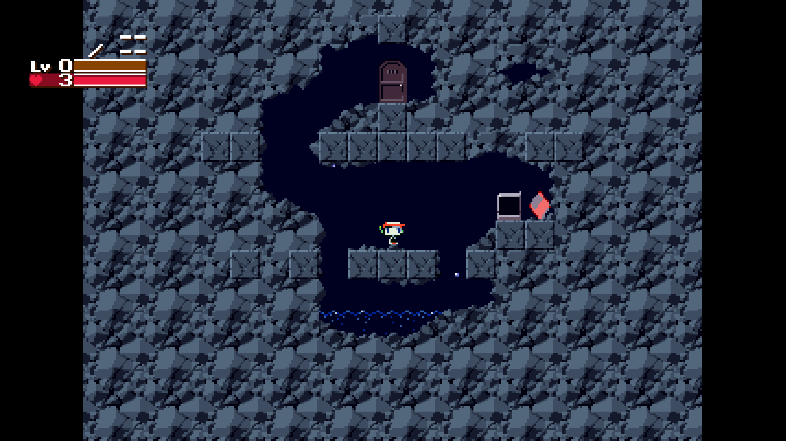
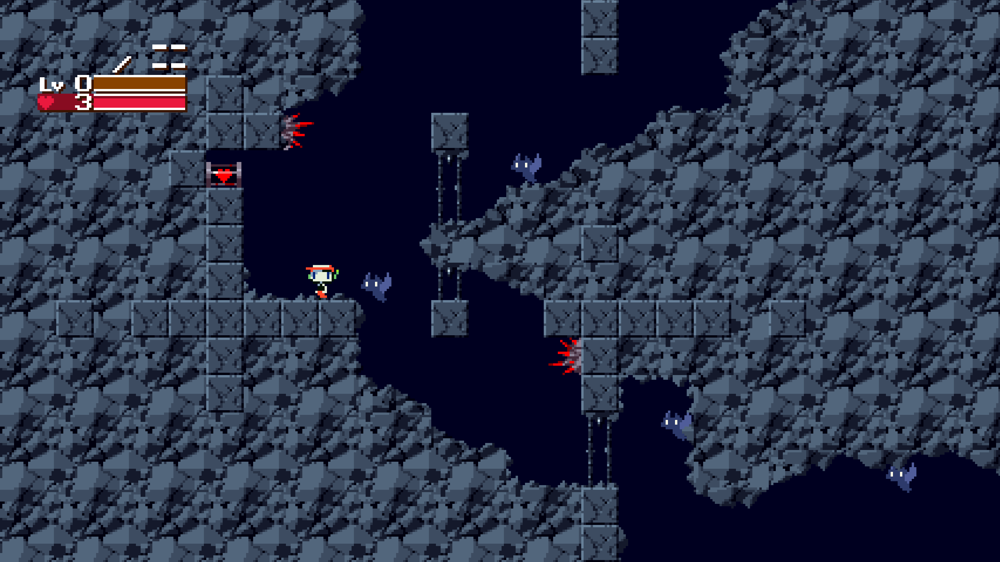
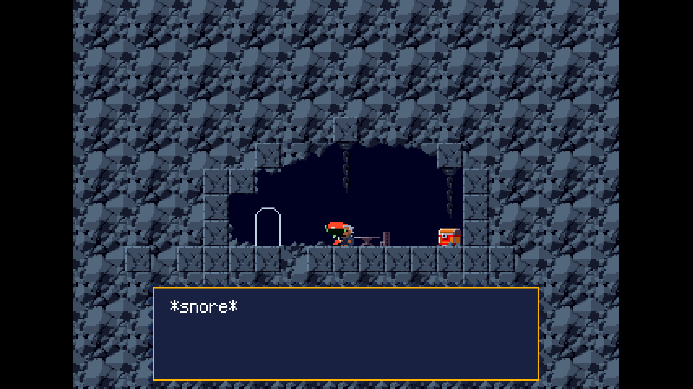

# First Cave

Upon opening the game, you will be given an opening monologue from someone who identifies himself as Kazuma. He is apparentally looking for someone named Sue. We will put a pin in that as we have just gained control of our character and that is vastly more interesting than this mystery green haired man.  

The basic controls are using the arrow keys to move left and right, up to look up, down to interact and look down, z to jump, and x to shoot/use your weapon. "But wait, I don't have a weapon!" Don't worry, we will get one soon. You can use this starting room to get comfortable with the controls. Once you are ready, jump up to the top area and interact with the door.  

You will be placed in the corridor of a cave. Going right will just lead you to a funny looking wall, so let's go left. The red spikes will kill you if you touch them alongside the bats if you fall into them a couple of times, but you may notice a neat looking canister in the wall.  

Interacting with this canister will net you a +3 health upgrade. The size of these health upgrades depends on the canister, so it is recommended to just pick up health upgrade canisters when you see them.  

Continuing down the corridor, you will reach a lion shaped doorway. Entering will bring you to a small area with a sleeping hermit and a chest.

Well he looks asleep to me, so going up and interacting with the chest will net us our first weapon, the Polar Star, a small pistol-esq gun that you will carry with you for a good portion of the game depending on your choices. You will then get another scene with Kazuma. Once that is done, you can exit the room.  

With this gun in hand, we now can attack and kill monsters. Right now, monsters will drop either XP or health pickups that refill your HP. There is nothing left to do down here, so make your way back up to the top of the corridor. If you wish, make a save point at the room you started in using the spinning floppy disk.  

If you try to shoot at the silver blocks that previously stopped you, you can break them by shooting at them. Break through the wall using your gun and take out the monsters. The door is a somewhat special type of door where you have to shoot at it a couple of times before it opens and lets you through. Let loose and then walk through the door.  

Welcome to Cave Story.
