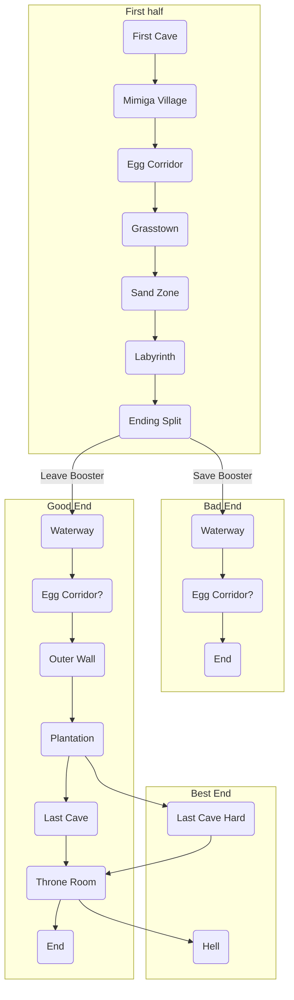

# Chapter 1

```admonish warning
This guide is work in progress and contains spoilers! Please proceed with caution.
```


```mermaid
flowchart TD;

subgraph "First half";
    A(First Cave) --> B(Mimiga Village);
    B --> C(Egg Corridor);
    C --> D(Grasstown);
    D --> E(Sand Zone);
    E --> F(Labyrinth);
    F --> F1(Ending Split);
    end;

subgraph "Bad End";
    F1 -->|Save Booster|G(Waterway);
    G --> H(Egg Corridor?);
    H --> J(End);
    end

subgraph "Good End";
    F1 -->|Leave Booster|G1(Waterway);
    G1 --> H1(Egg Corridor?);
    H1 --> J1(Outer Wall);
    J1 --> L1(Plantation);
    L1 --> M1(Last Cave);
    M1 --> N1(Throne Room);
    N1 --> O1(End);
    end;

subgraph "Best End";
    L1 --> M2(Last Cave Hard);
    M2 --> N1;
    N1 --> O2(Hell);
    end;
```
