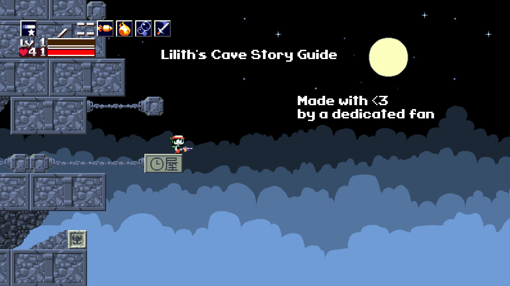

# A Guide to Cave Story

```admonish warning
This guide is work in progress and contains spoilers! Please proceed with caution.  

Additionally, this guide is not compatiable with Cave Story 3D.
```



Cave Story, or Doukutsu Monogatari, considered by many to be one of the greatest indie games ever made. It was made by a single person, Daisuke "Pixel" Amaya, as a passion project. Cave Story has been out for almost 20 years at the time of writing this, but has still managed to stand the test of time as an incredibly fun and rewarding game.  

That being said, despite the game's linear nature, it can sometimes be a little bit obtuse in how to get things like better weapons or its best ending. This guide hopes to explain how to get all the weapons, endings, and extra items within Cave Story. That is where this guide comes in.  

This guide aims to be a semi modern take on [old text guides from days past](https://www.cavestory.org/guides/CaveStoryFAQ.txt). The writer of this hopes to make a nice relaxing guide to an amazing game. If you follow this guide, you should be able to get all the upgrades, the two best weapons in the game, and get the best ending, without majorly spoiling yourself.

Lilith's Cave Story Guide © 2024 by Lilith is licensed under Creative Commons Attribution-NonCommercial-ShareAlike 4.0 International